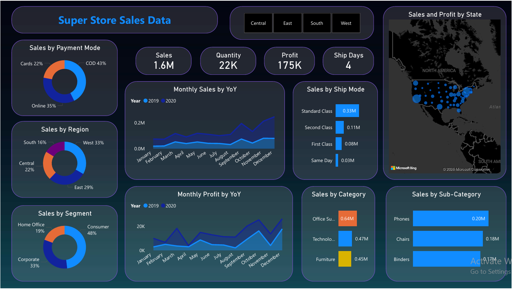

## 🛒 Super Store Sales Dashboard (Power BI)

This project analyzes **Super Store sales data** using Power BI to uncover sales performance trends, profit insights, regional distribution, customer segments, shipping modes, and short-term sales forecasting.

## 📸 Dashboard Preview

### 🔹 Key Insights
- Total Sales: 1.6M  
- Total Quantity Sold: 22K  
- Total Profit: 175K  
- Average Ship Days: 4  
- Sales by Category (Office Supplies, Technology, Furniture)  
- Sales by Sub-Category (Phones, Chairs, Binders, etc.)  
- Sales by Segment (Consumer, Corporate, Home Office)  
- Sales by Region (West, East, Central, South)  
- Sales by State (Top-performing states like California, New York)  
- Sales by Payment Mode (COD, Online, Cards)  
- Sales by Ship Mode (Standard, Second, First Class, Same Day)  
- Monthly Sales by Year-over-Year (2019 vs 2020)  
- Monthly Profit by Year-over-Year  
- 15 Days Sales Forecast  

### 🛠 Tools Used
- Power BI Desktop  
- DAX  
- Data Modeling  
- Data Visualization  
- Time Series Forecasting  

### 📂 Files
- `SuperStore_Sales_Dashboard.pbix` – Power BI report  
- `SuperStore_Sales_Dashboard.pdf` – Exported dashboard  
- `dashboard.png` – Dashboard preview  

### 📌 How to Use
Download the `.pbix` file and open it in **Power BI Desktop** to explore interactive insights.
